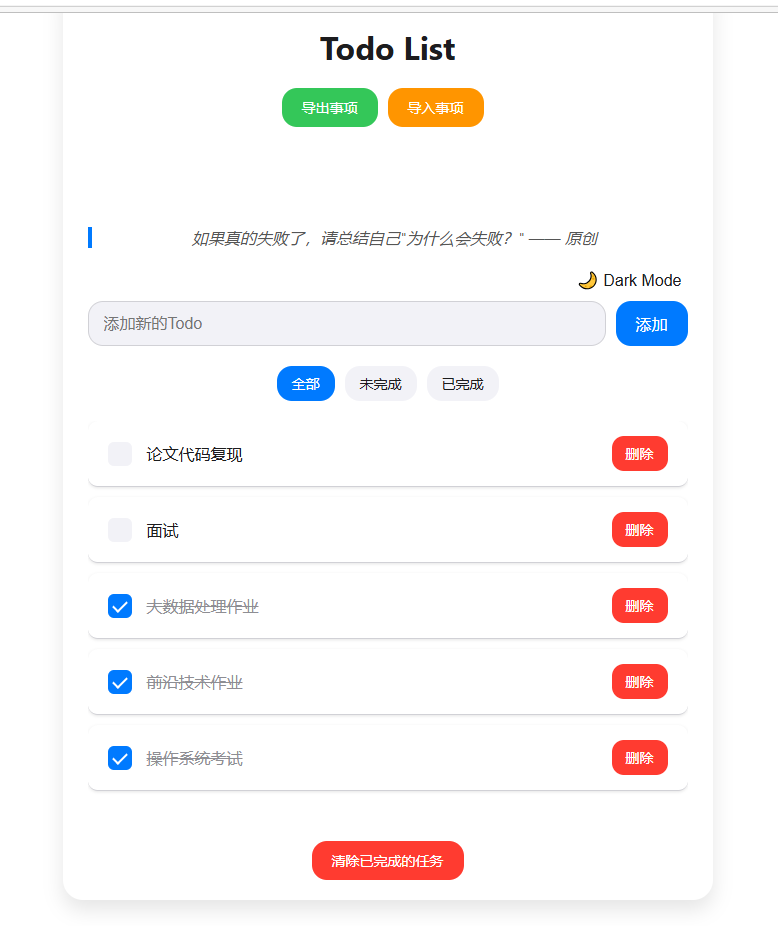
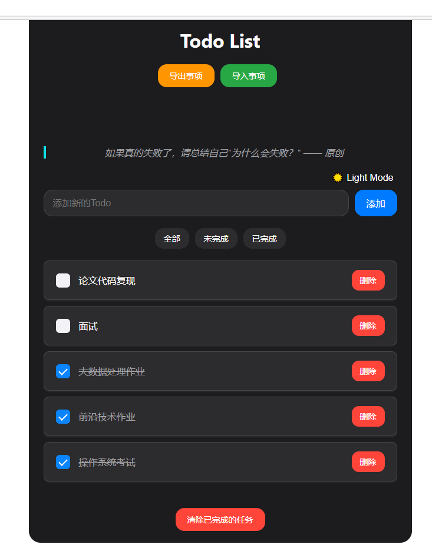
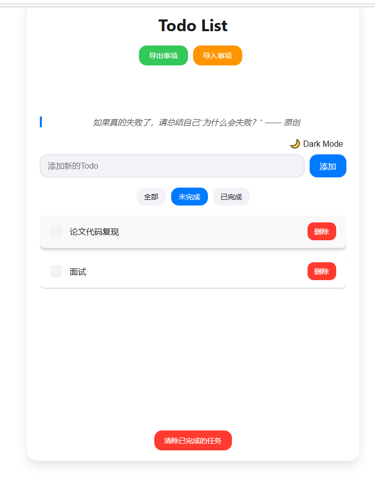
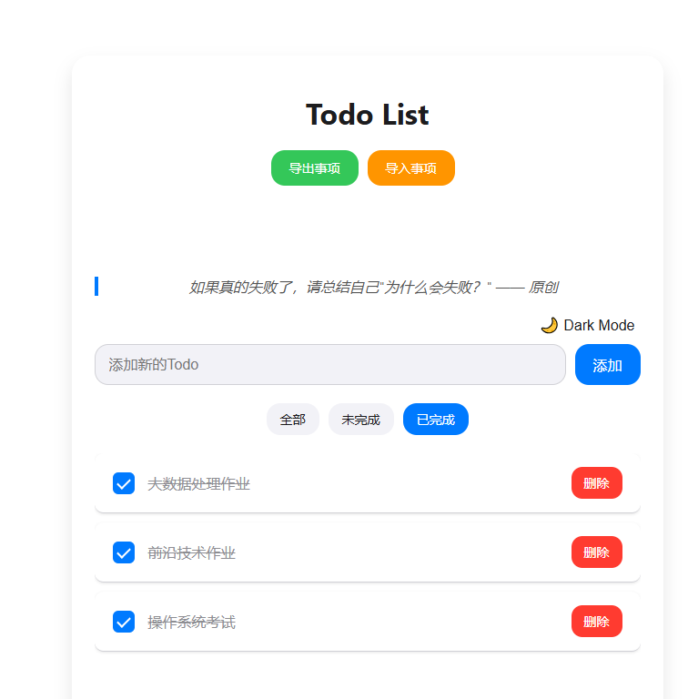

# todolist     
11月10日下午 
vue练手小项目。   

## 已经实现功能：
### 功能    
增加，删除事项
分为三类，分别显示，模仿小米待办事项显示逻辑 后续可再次改进
增加每日一言，后面可以改进为 缩小言语范围

跨平台 无
离线应用
### UI    
主题切换， 追求更多主题
界面变化   追求平滑 ，有反馈  

### 效果展示       
    

      

       

    

